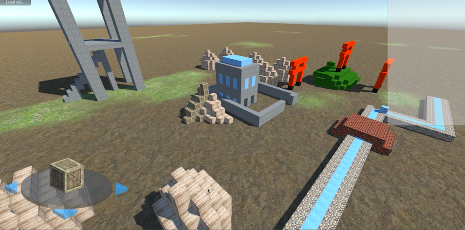

# ChainX
ChainVoxelを使った3Dモデルのための協調編集システムです．（ChainVoxelについては[こちら](http://github.com/kengo92i/ChainVoxel-Simulator)）．

## 実行方法
`./ChainX/Assets/Scene/Main.unity`を実行して、アプリケーションをスタートさせるとプロジェクトを起動できます．その後サーバを起動し，複数クライアントを起動させると協調編集シミュレーションができます．

    $ cd ./ChainX/
    $ open ./Assets/Scene/Main.unity //Launch Unity
    $ cd server/websocket/
    $ node server.js
    $ //Push a running button on Unity.app
    $ make chain //Clients start to edit

## 環境
- Client
	- Game engine: Unity 5.12.5
- Server
	- Scripter: NodeJS 6.11.2
	- Library: WebSocket 3.0.0

## 性能評価
`./server/websocket/evaluated_data/img/`に性能評価の結果があります．

## 参考文献&リンク
- K. Imae and N. Hayashibara, "ChainVoxel: A Data Structure for Scalable Distributed Collaborative Editing for 3D Models," In Proc. of The 14th IEEE International Conference on Dependable, Autonomic and Secure Computing (DASC-2016), August 2016. (Auckland, New Zealand)
- Tasuku Takahashi, Kengo Imae, Naohiro Hayashibara, “Towards A Collaborative Editing System on 3D Space”, BWCCA 2017/3PGCIC-2017, Nov 8-10, 2017.(Barcelona, Spain)
- [ChainVoxel-Simulator](http://github.com/kengo92i/ChainVoxel-Simulator) - A simulator for ChainVoxel

